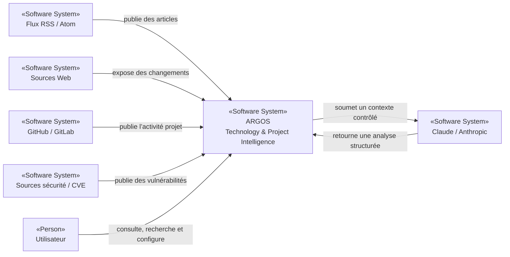

# ARGOS — Technology & Project Intelligence Platform

> **Observer. Corréler. Comprendre. Anticiper.**

ARGOS est une plateforme de **Technology Intelligence** et **Project Intelligence** destinée à centraliser la veille technologique, les flux RSS/Atom, les changements de documentation, les releases, les vulnérabilités, les signaux GitHub/GitLab et les indicateurs factuels d’avancement des projets.

Le nom **ARGOS** assume une double référence. Dans la mythologie grecque, **Argos Panoptès** est le gardien aux multiples yeux, symbole d’une vigilance continue. Dans l’univers **Supergirl**, **Argo City** renvoie aux origines kryptoniennes de Kara Zor‑El. Cette double lecture correspond à l’ambition du projet : **surveiller de nombreuses sources, relier les signaux importants et donner une vision claire de l’écosystème technologique et des projets**.

## Statut

**Phase : conception / cadrage architectural initial.**

Au moment de cette mise à jour, le dépôt ne contient encore qu’un README initial. Aucune implémentation applicative, configuration, Dockerfile, pipeline CI/CD, schéma de données, API ni ADR n’est encore présent.

Les choix techniques décrits dans `docs/architecture/` sont donc classés comme :

- **Décision proposée** lorsqu’un choix est recommandé mais pas encore implémenté ;
- **Hypothèse à valider** lorsqu’une preuve dans le code ou l’environnement est encore nécessaire ;
- **Non déterminé** lorsque l’information manque réellement.

## Mission

ARGOS doit permettre de :

- agréger des **flux RSS/Atom** et d’autres sources de veille ;
- détecter les changements de pages et documentations techniques ;
- surveiller releases, dépendances et vulnérabilités ;
- collecter les signaux GitHub/GitLab : issues, milestones, PR/MR, pipelines, releases et déploiements ;
- construire des métriques projet **factuelles et traçables** ;
- corréler les événements externes avec les technologies et projets internes ;
- utiliser **Claude / Anthropic** pour synthétiser, classifier et analyser les impacts, sans substituer l’IA aux données sources ;
- produire des tableaux de bord, alertes et synthèses périodiques utiles aux équipes techniques et aux responsables.

## Vision fonctionnelle

## Principes d’architecture visés

- **Monolithe modulaire** en première intention, plutôt que microservices prématurés.
- **Modèle canonique d’événements** pour découpler ARGOS des formats GitHub, GitLab, RSS et autres sources externes.
- **PostgreSQL** comme stockage principal ; JSONB, recherche plein texte et, si justifié, `pgvector`.
- **API REST documentée avec OpenAPI**.
- **Claude derrière un AI Gateway interne**, avec sorties structurées, budgets, audit et possibilité future de changer de fournisseur.
- **Mermaid** comme source de vérité de tous les diagrammes.
- **arc42** pour la documentation d’architecture.
- **ADR Markdown** pour conserver l’historique des décisions structurantes.
- Approche **gratuit / self-hosted d’abord**, passage au payant uniquement lorsqu’un bénéfice concret est démontré.

> Les technologies précises restent à confirmer par les premiers ADR et le POC. Voir la documentation d’architecture pour les hypothèses et critères de validation.

## Documentation d’architecture

Le dossier principal se trouve dans [`docs/architecture/`](docs/architecture/README.md).

Il combine :

- **arc42** pour la structure documentaire ;
- **C4** pour les vues Context, Container et Component ;
- **Mermaid** pour tous les diagrammes ;
- une notation UML-style avec stéréotypes explicites ;
- **ADR** pour les décisions ;
- scénarios qualité mesurables ;
- registre des risques et dette technique.

## Conventions de preuve

| Marqueur | Signification |
|---|---|
| **Observé** | preuve disponible dans le dépôt ou dans un artefact versionné |
| **Hypothèse à valider** | proposition nécessitant une preuve, un POC ou une décision |
| **Non déterminé** | information absente au moment de l’analyse |

## Prochaines étapes

1. Valider les objectifs métier et les parties prenantes.
2. Créer les premiers ADR structurants.
3. Prototyper le pipeline RSS → normalisation → stockage → restitution.
4. Prototyper l’intégration GitHub/GitLab.
5. Valider le modèle métier et les métriques projet.
6. Valider l’intégration Claude, les règles de confidentialité et la maîtrise des coûts.
7. Transformer les hypothèses d’architecture en décisions vérifiées par le code et les tests.

## Licence

**Non déterminé.** Une licence devra être choisie explicitement avant diffusion ou contribution externe.
