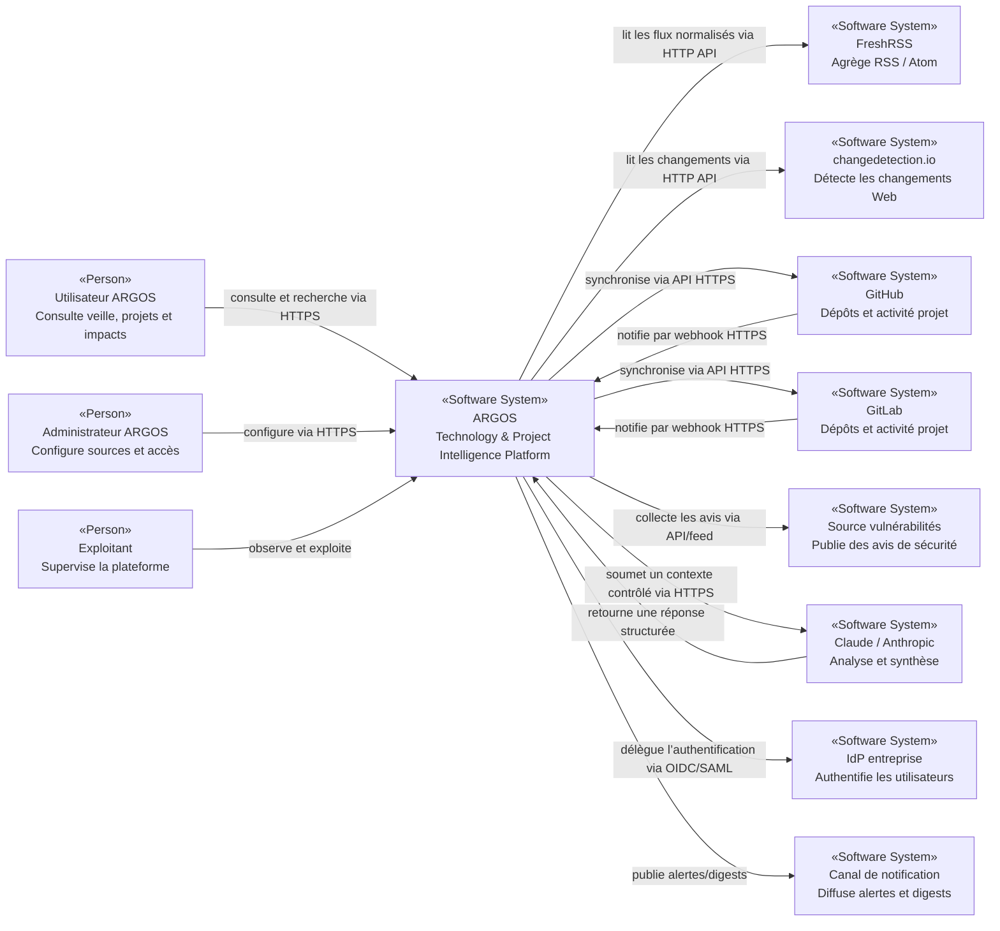

# 3. Contexte et périmètre

## 3.1 Frontière du système

ARGOS est considéré comme un **Software System** autonome qui consomme des sources externes, conserve un modèle interne normalisé et restitue de l’information aux utilisateurs.

### Dans la frontière ARGOS

- collecte et orchestration d’ingestion ;
- normalisation et déduplication ;
- modèle métier ;
- corrélation technologie ↔ projet ;
- recherche ;
- calcul de métriques factuelles ;
- AI Gateway ;
- tableaux de bord ;
- alertes/digests ;
- contrôle d’accès et audit applicatif.

### Hors frontière ARGOS

- GitHub/GitLab ;
- FreshRSS ;
- changedetection.io ;
- fournisseurs RSS/Atom ;
- sources CVE/sécurité ;
- Claude/Anthropic ;
- fournisseur d’identité d’entreprise ;
- services de notification externes ;
- éventuellement n8n.

> **Hypothèse à valider :** FreshRSS et changedetection.io sont représentés comme systèmes séparés afin d’éviter de coupler ARGOS à leur stockage ou code interne.

## 3.2 Acteurs

| Acteur | Interaction principale | État |
|---|---|---|
| Utilisateur technique | consulte veille, impacts, projets et recherche | Hypothèse à valider |
| Responsable projet | consulte synthèses, jalons, risques et activité | Hypothèse à valider |
| Administrateur | gère workspaces, sources, droits et intégrations | Hypothèse à valider |
| Exploitant | supervise, restaure et diagnostique la plateforme | Hypothèse à valider |

## 3.3 Systèmes externes

| Système | Rôle | Interface pressentie | État |
|---|---|---|---|
| FreshRSS | agrégation RSS/Atom | API HTTP | Hypothèse à valider |
| changedetection.io | surveillance de changements Web | API HTTP / webhook si disponible | Hypothèse à valider |
| GitHub | activité projets et dépôts | REST/GraphQL + webhooks | Hypothèse à valider |
| GitLab | activité projets et dépôts | REST/GraphQL selon besoin + webhooks | Hypothèse à valider |
| Sources CVE | vulnérabilités | API/feed | Non déterminé |
| Claude / Anthropic | analyses/synthèses structurées | HTTPS API | Hypothèse à valider |
| IdP entreprise | authentification fédérée | OIDC ou SAML | Non déterminé |
| Notification | mail/Teams/Slack/etc. | webhook/API/SMTP | Non déterminé |

## 3.4 C4 — System Context

**Type : C4 Context. Portée : ARGOS et son environnement direct.**

## 3.5 Interfaces

### Interfaces entrantes

- interface Web utilisateur ;
- API applicative ;
- endpoints webhook GitHub/GitLab ;
- callbacks d’authentification OIDC/SAML.

### Interfaces sortantes

- APIs GitHub/GitLab ;
- API FreshRSS ;
- API changedetection.io ;
- sources sécurité ;
- API Claude ;
- services de notification.

## 3.6 Données échangées

| Flux | Données principales | Sensibilité pressentie |
|---|---|---|
| RSS/Web → ARGOS | titres, liens, contenu, dates | Public à Internal |
| GitHub/GitLab → ARGOS | issues, PR/MR, pipelines, releases, utilisateurs | Internal à Confidential |
| ARGOS → Claude | extraits de contenu, contexte projet sélectionné | dépend de la classification |
| ARGOS → utilisateurs | veille, impacts, métriques, synthèses | Internal |

## 3.7 Questions ouvertes

- Les deux SCM doivent-ils être supportés au MVP ?
- Les dépôts privés peuvent-ils être analysés par Claude ?
- Quels événements webhook seront activés ?
- Quelle source CVE est autorisée ?
- Quels canaux de notification sont requis ?

## 3.8 Risques associés

- dépendance aux limites/rate limits des APIs externes ;
- fuite de données si le contexte envoyé au LLM n’est pas filtré ;
- webhooks falsifiés si signatures/secrets mal validés ;
- couplage excessif à un fournisseur si le modèle canonique est insuffisant.

## 3.9 Fichiers source concernés

- `README.md`
- futurs adapters/connectors ;
- future spécification OpenAPI ;
- futurs manifests d’authentification et de déploiement.
