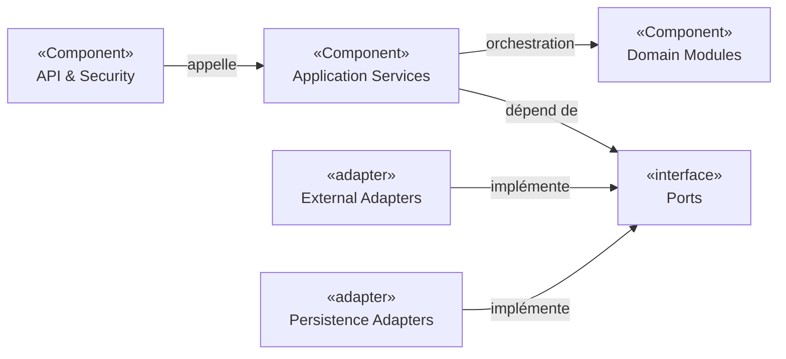

# 4. Stratégie de solution

## 4.1 Intention architecturale

ARGOS doit rester simple à exploiter au démarrage tout en préservant la capacité d’ajouter des sources, des analyses et des modes de restitution.

La stratégie proposée repose sur un **monolithe modulaire** avec des frontières métier explicites et des adapters pour les systèmes externes.

**Statut : Décision proposée / Hypothèse à valider par ADR et POC.**

## 4.2 Principes

### P1 — Modularité avant distribution

Commencer avec un seul déploiement backend, mais des modules métier séparés. Les microservices ne seront envisagés que si un besoin mesurable apparaît : indépendance de déploiement, scalabilité asymétrique, isolation sécurité ou ownership séparé.

### P2 — Modèle canonique interne

Aucune logique métier ne doit dépendre directement des payloads GitHub, GitLab, RSS ou changedetection.io.

Les adapters traduisent les événements externes vers des concepts internes stables :

- `IntelligenceItem` ;
- `ProjectActivity` ;
- `SecuritySignal` ;
- `ReleaseSignal` ;
- `ProjectImpact`.

### P3 — Données sources traçables

Toute analyse doit conserver :

- source ;
- identifiant externe ;
- date de collecte ;
- payload brut ou référence permettant l’audit ;
- version de l’analyse/prompt lorsqu’un LLM intervient.

### P4 — IA non souveraine

Claude synthétise et classe, mais ne devient pas la source de vérité. Les métriques projet proviennent des données GitHub/GitLab et les décisions de sécurité restent déterministes ou humaines.

### P5 — Gratuit/self-hosted d’abord

Privilégier les composants sans licence payante obligatoire lorsque cela ne dégrade pas les objectifs qualité. Le passage à un service payant doit être motivé par un bénéfice mesurable : SLA, SSO, support, sécurité, capacité, réduction d’exploitation ou qualité IA.

### P6 — Asynchronisme ciblé

L’ingestion et certaines analyses sont naturellement asynchrones. L’architecture doit permettre retry, idempotence et reprise, sans introduire une plateforme de messaging distribuée avant d’en avoir besoin.

## 4.3 Technologies structurantes proposées

| Domaine | Proposition | Statut | Validation attendue |
|---|---|---|---|
| Backend | Java + Spring Boot | Hypothèse à valider | ADR + POC |
| Architecture code | monolithe modulaire | Décision proposée | ADR-0001 |
| Base principale | PostgreSQL | Décision proposée | ADR-0002 |
| Migrations | Flyway | Hypothèse à valider | POC build + migration |
| Recherche | PostgreSQL FTS en première intention | Hypothèse à valider | benchmark fonctionnel |
| Similarité | pgvector si cas d’usage démontré | Hypothèse à valider | POC RAG/déduplication |
| API | REST + OpenAPI | Hypothèse à valider | ADR/API prototype |
| Frontend | React ou Vue | Non déterminé | comparaison + ADR |
| IA | Claude via AI Gateway | Décision proposée | ADR-0004 |
| RSS | FreshRSS séparé | Décision proposée | ADR-0006 + POC |
| Web watch | changedetection.io séparé | Décision proposée | ADR-0006 + POC |
| Automatisation | n8n périphérique uniquement | Décision proposée | ADR-0007 |
| IAM | OIDC vers IdP entreprise | Décision proposée | ADR-0008 |
| Diagrammes | Mermaid | Imposé | présent dans cette documentation |

## 4.4 Mécanismes par objectif qualité

| Objectif | Mécanismes proposés |
|---|---|
| Traçabilité | IDs externes, payload source, provenance, audit, version de prompt/modèle |
| Confidentialité | classification des données, filtrage avant LLM, RBAC, chiffrement, secrets externes |
| Maintenabilité | modules métier, ports/adapters, modèle canonique, ADR, tests de contrats |
| Fiabilité | idempotence, retry borné, statut de traitement, DLQ logique ou table d’échec |
| Coût | préfiltrage déterministe, déduplication, cache, batch IA, quotas par workspace |
| Observabilité | logs structurés, métriques, traces, corrélation par event ID |

## 4.5 Style de décomposition

Le schéma exprime une direction de dépendance : le domaine ne dépend pas des SDK externes.

## 4.6 ADR associés

- [ADR-0001 — Monolithe modulaire](../adr/0001-monolithe-modulaire.md)
- [ADR-0002 — PostgreSQL comme stockage principal](../adr/0002-postgresql-stockage-principal.md)
- [ADR-0003 — Modèle canonique d’événements](../adr/0003-modele-canonique-evenements.md)
- [ADR-0004 — AI Gateway Claude](../adr/0004-ai-gateway-claude.md)
- [ADR-0006 — FreshRSS et changedetection séparés](../adr/0006-collecteurs-separes.md)
- [ADR-0007 — n8n périphérique](../adr/0007-n8n-peripherique.md)
- [ADR-0008 — IAM OIDC](../adr/0008-iam-oidc.md)

## 4.7 Questions ouvertes

- Spring Modulith est-il souhaitable pour renforcer les frontières ?
- Un broker (Kafka/RabbitMQ/etc.) est-il nécessaire au-delà du POC ?
- Le frontend doit-il être SPA séparée ou servi par le backend ?
- L’entreprise impose-t-elle des composants de monitoring ou IAM existants ?

## 4.8 Preuves et fichiers source

### Observé

- aucune stack applicative n’est encore implémentée ;
- `README.md` et cette documentation établissent l’intention.

### Preuves nécessaires

- manifests de build ;
- structure de packages/modules ;
- tests d’architecture ;
- manifests de déploiement ;
- résultats de POC.
