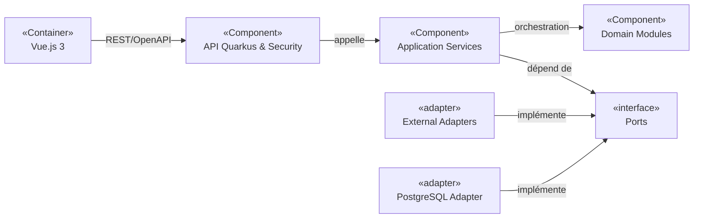

# 4. Stratégie de solution

## 4.1 Intention architecturale

ARGOS doit rester simple à exploiter au démarrage tout en préservant la capacité d’ajouter des sources, des analyses et des modes de restitution.

La stratégie proposée repose sur un **monolithe modulaire Quarkus** avec des frontières métier explicites et des adapters pour les systèmes externes. La stack applicative est désormais fixée par ADR-0019 : **Java 17 minimum, Quarkus, Vue.js 3 et PostgreSQL**.

Le POC peut démarrer localement sous Docker Compose sans attendre la VM d’entreprise ; le POC partagé et le MVP migrent ensuite sur la VM interne.

## 4.2 Principes

### P1 — Modularité avant distribution

Commencer avec un seul déploiement backend Quarkus, mais des modules métier séparés. Les microservices ne seront envisagés que si un besoin mesurable apparaît : indépendance de déploiement, scalabilité asymétrique, isolation sécurité ou ownership séparé.

### P2 — Modèle canonique interne

Aucune logique métier ne doit dépendre directement des payloads GitHub, GitLab, RSS ou changedetection.io.

Les adapters traduisent les événements externes vers des concepts internes stables :

- `IntelligenceItem` ;
- `ProjectActivity` ;
- `SecuritySignal` ;
- `ReleaseSignal` ;
- `ProjectImpact`.

### P3 — Données sources traçables

Toute analyse doit conserver source, identifiant externe, date de collecte, payload brut ou référence d’audit et version de l’analyse/prompt lorsqu’un LLM intervient.

### P4 — IA non souveraine

Claude synthétise et classe, mais ne devient pas la source de vérité. Les métriques projet proviennent des données GitHub/GitLab et les décisions de sécurité restent déterministes ou humaines.

### P5 — Gratuit/self-hosted d’abord

Privilégier les composants sans licence payante obligatoire lorsque cela ne dégrade pas les objectifs qualité.

### P6 — Asynchronisme ciblé

L’ingestion et certaines analyses sont naturellement asynchrones. L’architecture doit permettre retry, idempotence et reprise, sans introduire une plateforme de messaging distribuée avant d’en avoir besoin.

### P7 — Personnalisation à deux niveaux

Chaque utilisateur hérite du **socle d’équipe** et peut ajouter une **veille personnelle**. Les préférences personnelles ne modifient jamais les autorisations sur les projets et données internes.

## 4.3 Technologies structurantes

| Domaine | Proposition | Statut | Validation attendue |
|---|---|---|---|
| JDK | Java 17 minimum | Accepté | ADR-0019 |
| Backend/API | Quarkus | Accepté | ADR-0019 + POC |
| Architecture code | monolithe modulaire | Décision proposée | ADR-0001 |
| Base principale | PostgreSQL | Accepté | ADR-0002 + ADR-0019 |
| Migrations | Flyway ou Liquibase | Hypothèse à valider | POC build + migration |
| Recherche | PostgreSQL FTS en première intention | Décision proposée | ADR-0015 |
| Similarité | pgvector si cas d’usage démontré | Décision proposée | ADR-0015 |
| API | REST + OpenAPI | Accepté dans la stack cible | ADR-0019 |
| Frontend | Vue.js 3 en SPA | Accepté | ADR-0019 |
| MCP | Quarkus MCP Server / Quarkiverse, Streamable HTTP | Décision proposée | ADR-0014 + POC |
| IA | Claude via AI Gateway | Décision proposée | ADR-0004 |
| RSS | FreshRSS séparé | Décision proposée | ADR-0006 + POC |
| Web watch | changedetection.io séparé | Décision proposée | ADR-0006 + POC |
| Automatisation | n8n périphérique uniquement | Décision proposée | ADR-0007 |
| IAM | OIDC vers IdP entreprise | Décision proposée | ADR-0008 |
| Diagrammes | Mermaid | Imposé | ADR-0005 |

## 4.4 Mécanismes par objectif qualité

| Objectif | Mécanismes proposés |
|---|---|
| Traçabilité | IDs externes, payload source, provenance, audit, version de prompt/modèle |
| Confidentialité | classification des données, filtrage avant LLM, RBAC, RLS, chiffrement, secrets externes |
| Maintenabilité | modules métier, ports/adapters, modèle canonique, ADR, tests de contrats, ArchUnit |
| Fiabilité | idempotence, retry borné, statut de traitement, DLQ logique ou table d’échec |
| Coût | préfiltrage déterministe, déduplication, cache, batch IA, quotas par workspace |
| Observabilité | OpenTelemetry/Micrometer, logs structurés, métriques, traces, corrélation par event ID |

## 4.5 Style de décomposition

```mermaid
flowchart LR
    UI["«Container»\nVue.js 3"]
    API["«Component»\nAPI Quarkus & Security"]
    DOMAIN["«Component»\nDomain Modules"]
    APP["«Component»\nApplication Services"]
    PORTS["«interface»\nPorts"]
    ADAPTERS["«adapter»\nExternal Adapters"]
    DATA["«adapter»\nPostgreSQL Adapter"]

    UI -->|REST/OpenAPI| API
    API -->|appelle| APP
    APP -->|orchestration| DOMAIN
    APP -->|dépend de| PORTS
    ADAPTERS -->|implémente| PORTS
    DATA -->|implémente| PORTS
```

## 4.6 ADR associés

- [ADR-0001 — Monolithe modulaire](../adr/0001-monolithe-modulaire.md)
- [ADR-0002 — PostgreSQL comme stockage principal](../adr/0002-postgresql-stockage-principal.md)
- [ADR-0003 — Modèle canonique d’événements](../adr/0003-modele-canonique-evenements.md)
- [ADR-0004 — AI Gateway Claude](../adr/0004-ai-gateway-claude.md)
- [ADR-0006 — FreshRSS et changedetection séparés](../adr/0006-collecteurs-separes.md)
- [ADR-0007 — n8n périphérique](../adr/0007-n8n-peripherique.md)
- [ADR-0008 — IAM OIDC](../adr/0008-iam-oidc.md)
- [ADR-0014 — MCP lecture seule](../adr/0014-mcp-readonly-streamable-http.md)
- [ADR-0017 — Déploiement POC/MVP](../adr/0017-deploiement-vm-conteneurs.md)
- [ADR-0019 — Stack Java 17+/Quarkus/Vue.js 3/PostgreSQL](../adr/0019-stack-java17-quarkus-vue3-postgresql.md)

## 4.7 Questions ouvertes

- Un broker (Kafka/RabbitMQ/etc.) est-il nécessaire au-delà du POC ?
- Flyway ou Liquibase est-il préférable dans le contexte interne ?
- L’entreprise impose-t-elle des composants de monitoring, secrets management ou IAM existants ?
- Quel mécanisme de notifications Teams/e-mail est disponible ?

## 4.8 Preuves nécessaires

- manifests Maven/Quarkus et frontend Vue.js 3 ;
- structure de packages/modules ;
- tests d’architecture ;
- Docker Compose local ;
- manifests de déploiement VM ;
- résultats de POC.
