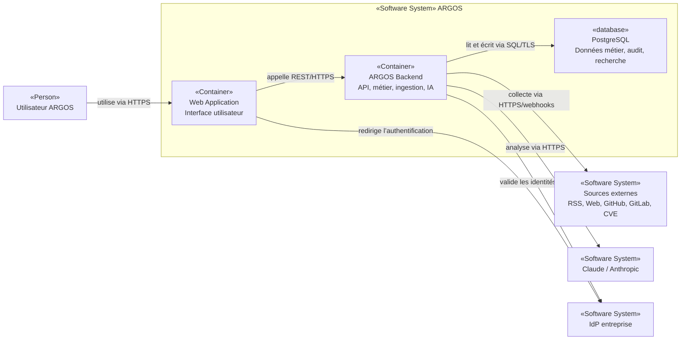
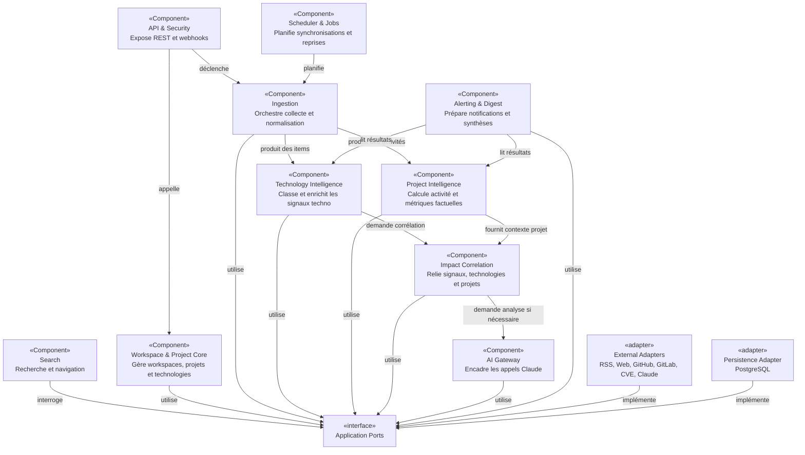
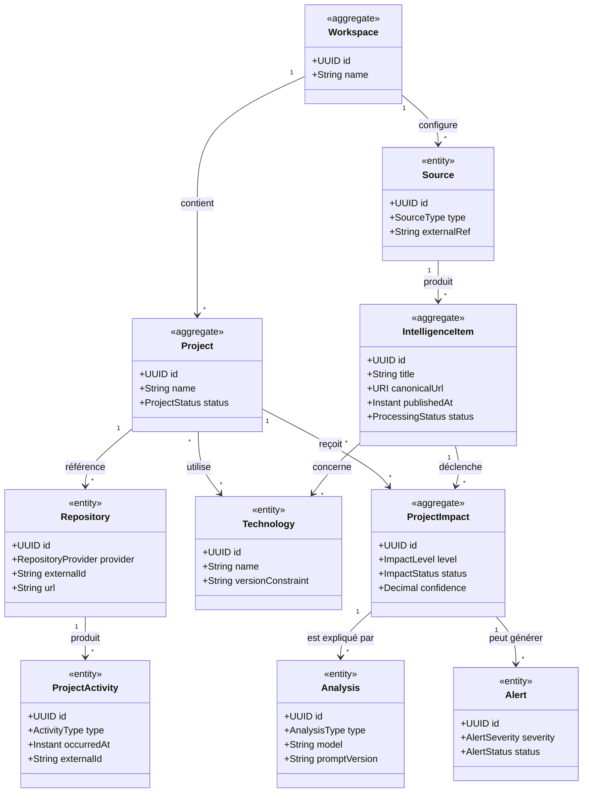

# 5. Vue des blocs

Cette section décrit les niveaux **C4 Container** puis **C4 Component**. Les noms définis ici doivent être réutilisés dans les scénarios d’exécution.

## 5.1 C4 Container

**Type : C4 Container. Portée : intérieur du système ARGOS.**

### Web Application

- **Responsabilité** : navigation, tableaux de bord, recherche, administration fonctionnelle.
- **Interfaces** : REST/OpenAPI vers `ARGOS Backend`, OIDC vers l’IdP.
- **Technologie** : **Non déterminé** (React/Vue à comparer).
- **Code source** : absent au moment de l’analyse.

### ARGOS Backend

- **Responsabilité** : API, règles métier, ingestion, corrélation, analyses IA, alertes, orchestration.
- **Interfaces** : REST, webhooks, APIs externes, SQL.
- **Technologie proposée** : Java + Spring Boot.
- **Code source** : absent au moment de l’analyse.

### PostgreSQL

- **Responsabilité** : persistance principale, audit, JSONB, FTS ; pgvector seulement si validé.
- **Interface** : SQL.
- **Code/configuration** : absent au moment de l’analyse.

## 5.2 C4 Component — ARGOS Backend

**Type : C4 Component. Portée : `ARGOS Backend`.**

## 5.3 Responsabilités et frontières

| Composant | Responsabilité | Ne doit pas |
|---|---|---|
| API & Security | exposition REST/webhooks, authn/authz, validation | contenir les règles métier |
| Ingestion | collecte, idempotence, normalisation, statut de traitement | connaître la présentation UI |
| Technology Intelligence | classifier/enrichir signaux technologiques | appeler directement un SDK externe |
| Project Intelligence | interpréter données projet factuelles | inventer un avancement subjectif |
| Impact Correlation | relier techno ↔ projets ↔ impacts | devenir dépendant de GitHub/GitLab |
| AI Gateway | prompts, modèles, quotas, structured output, audit | exposer Claude directement au domaine |
| Search | requêtes de recherche et navigation | imposer un moteur externe prématurément |
| Alerting & Digest | règles d’alerte et génération de digests | porter la logique de collecte |
| Workspace & Project Core | modèle central et ownership | dépendre des adapters |
| Scheduler & Jobs | orchestration temporelle/retry | devenir une plateforme workflow générale |

## 5.4 Modèle métier critique — UML-style classDiagram

**Type : UML class diagram. Portée : noyau métier conceptuel.**

Le diagramme est conceptuel. Les attributs et cardinalités restent **Hypothèses à valider** jusqu’à création du modèle de données et du code.

## 5.5 Règles de dépendance proposées

1. le domaine ne dépend pas des SDK externes ;
2. les adapters dépendent des ports, jamais l’inverse ;
3. `Project Intelligence` ne dépend pas de `Technology Intelligence` ;
4. `Impact Correlation` peut consommer les deux ;
5. `AI Gateway` est le seul composant autorisé à appeler un fournisseur LLM ;
6. les contrôleurs Web ne parlent pas directement à la base ;
7. les événements externes sont normalisés avant usage métier.

## 5.6 C4 Code

**Non pertinent à ce stade.** Aucun code n’existe encore. Un niveau Code ne devra être ajouté que pour une zone réellement complexe et stable, pas pour documenter chaque classe.

## 5.7 Preuves, hypothèses et risques

### Observé

- absence de code ;
- principes décrits dans le README.

### Hypothèses à valider

- existence de trois conteneurs principaux Web/Backend/PostgreSQL ;
- découpage des composants backend ;
- modèle de classes proposé.

### Preuves nécessaires

- packages/modules réels ;
- tests d’architecture ;
- spécification API ;
- schéma de données ;
- manifests de déploiement.

### Risques

- frontières de modules non respectées à l’implémentation ;
- `AI Gateway` contourné ;
- modèle canonique insuffisant ;
- sur-modélisation précoce.
