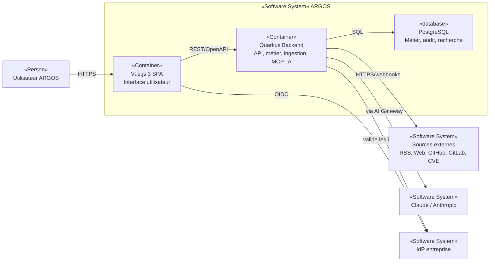
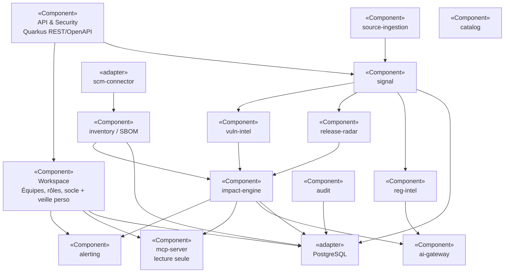

# 5. Vue des blocs

Cette section décrit les niveaux **C4 Container** puis **C4 Component**. La stack est fixée par ADR-0019 : Java 17 minimum, Quarkus, Vue.js 3 et PostgreSQL.

## 5.1 C4 Container

```mermaid
flowchart LR
    USER["«Person»\nUtilisateur ARGOS"]

    subgraph ARGOS["«Software System» ARGOS"]
        WEB["«Container»\nVue.js 3 SPA\nInterface utilisateur"]
        BACK["«Container»\nQuarkus Backend\nAPI, métier, ingestion, MCP, IA"]
        DB["«database»\nPostgreSQL\nMétier, audit, recherche"]
    end

    EXT["«Software System»\nSources externes\nRSS, Web, GitHub, GitLab, CVE"]
    AI["«Software System»\nClaude / Anthropic"]
    IDP["«Software System»\nIdP entreprise"]

    USER -->|HTTPS| WEB
    WEB -->|REST/OpenAPI| BACK
    BACK -->|SQL| DB
    BACK -->|HTTPS/webhooks| EXT
    BACK -->|via AI Gateway| AI
    WEB -->|OIDC| IDP
    BACK -->|valide les identités| IDP
```

### Vue.js 3 SPA

- navigation, tableaux de bord, recherche et préférences ;
- socle de veille d’équipe + veille personnelle ;
- aucune logique métier critique dans l’IHM.

### Quarkus Backend

- **Java 17 minimum** ;
- API REST/OpenAPI ;
- règles métier, ingestion, corrélation, alerting, AI Gateway et serveur MCP ;
- monolithe modulaire proposé ;
- aucune dépendance du domaine aux SDK externes.

### PostgreSQL

- persistance principale ;
- JSONB, FTS et RLS ;
- pgvector uniquement si besoin démontré.

## 5.2 C4 Component — Quarkus Backend

```mermaid
flowchart TB
    API["«Component»\nAPI & Security\nQuarkus REST/OpenAPI"]
    WORK["«Component»\nWorkspace\nÉquipes, rôles, socle + veille perso"]
    INGEST["«Component»\nsource-ingestion"]
    CATALOG["«Component»\ncatalog"]
    INVENTORY["«Component»\ninventory / SBOM"]
    SIGNAL["«Component»\nsignal"]
    VULN["«Component»\nvuln-intel"]
    RELEASE["«Component»\nrelease-radar"]
    REG["«Component»\nreg-intel"]
    IMPACT["«Component»\nimpact-engine"]
    ALERT["«Component»\nalerting"]
    MCP["«Component»\nmcp-server\nlecture seule"]
    AI["«Component»\nai-gateway"]
    SCM["«adapter»\nscm-connector"]
    AUDIT["«Component»\naudit"]
    DB["«adapter»\nPostgreSQL"]

    API --> WORK
    API --> SIGNAL
    INGEST --> SIGNAL
    SIGNAL --> VULN
    SIGNAL --> RELEASE
    SIGNAL --> REG
    INVENTORY --> IMPACT
    VULN --> IMPACT
    RELEASE --> IMPACT
    IMPACT --> ALERT
    IMPACT --> MCP
    REG --> AI
    IMPACT --> AI
    SCM --> INVENTORY
    WORK --> ALERT
    WORK --> MCP
    WORK --> DB
    SIGNAL --> DB
    INVENTORY --> DB
    IMPACT --> DB
    AUDIT --> DB
```

## 5.3 Responsabilités et frontières

| Composant | Responsabilité | Ne doit pas |
|---|---|---|
| API & Security | REST/OpenAPI, authn/authz, validation | contenir les règles métier |
| workspace | équipes, rôles, abonnements TEAM/PERSONAL, vues | confondre préférence de veille et autorisation |
| source-ingestion | collecte, idempotence, normalisation | connaître la présentation UI |
| catalog | technologies, standards, domaines métier | dépendre d’un fournisseur externe |
| inventory | projets, dépôts, SBOM, PURL | calculer seul l’impact sécurité |
| impact-engine | corrélation déterministe | déléguer la décision au LLM |
| ai-gateway | prompts, modèles, quotas, structured output, audit | exposer Claude directement au domaine |
| mcp-server | outils MCP lecture seule | modifier le domaine au MVP |
| alerting | règles d’alerte et digests | accorder des droits d’accès |
| scm-connector | GitLab/API/webhooks/SBOM | injecter les payloads fournisseurs dans le domaine |

## 5.4 Personnalisation

Une `Subscription` possède un `scope` :

- `TEAM` : socle d’équipe, éventuellement obligatoire ;
- `PERSONAL` : veille ajoutée volontairement par l’utilisateur.

Le scope de veille n’accorde **aucun droit supplémentaire** sur les projets. RBAC/RLS reste la source d’autorisation.

## 5.5 Règles de dépendance

1. le domaine ne dépend pas des SDK externes ;
2. les adapters dépendent des ports, jamais l’inverse ;
3. l’AI Gateway est le seul composant autorisé à appeler le fournisseur LLM ;
4. les contrôleurs Quarkus ne parlent pas directement à la base ;
5. les événements externes sont normalisés avant usage métier ;
6. les préférences personnelles sont séparées des politiques d’autorisation.

## 5.6 C4 Code

**Non pertinent à ce stade.** Aucun code applicatif n’existe encore.
