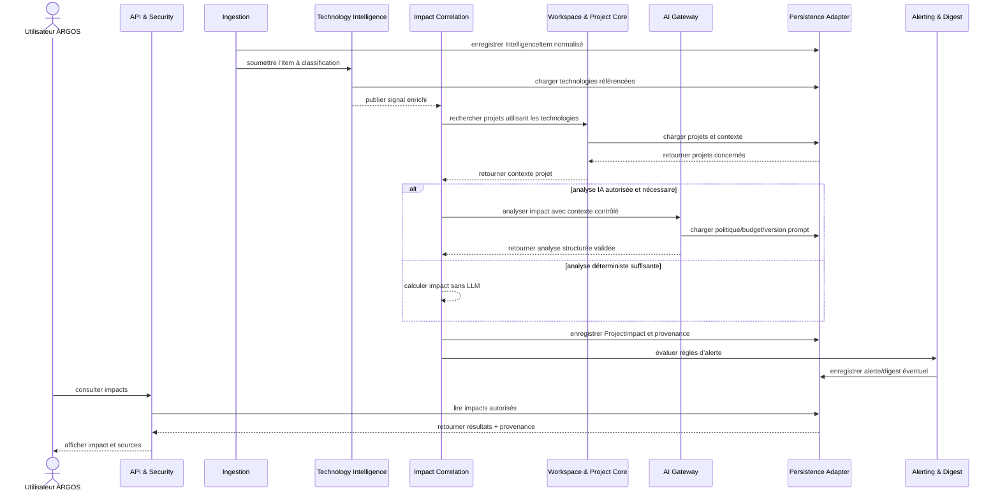
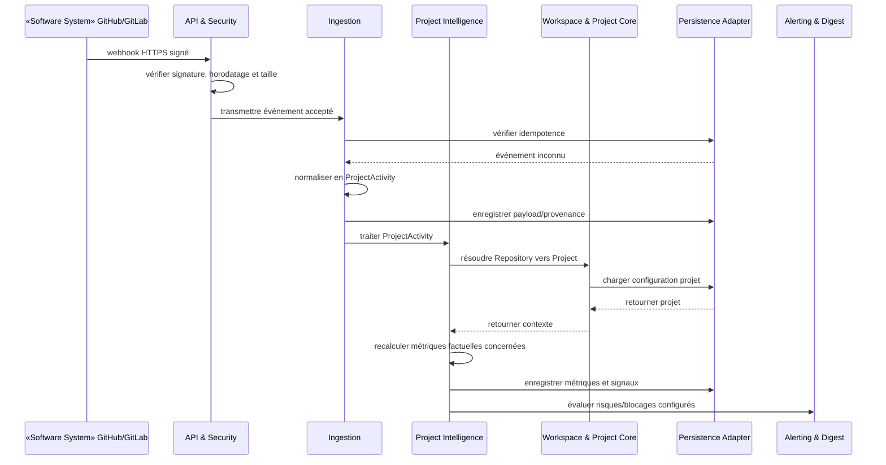
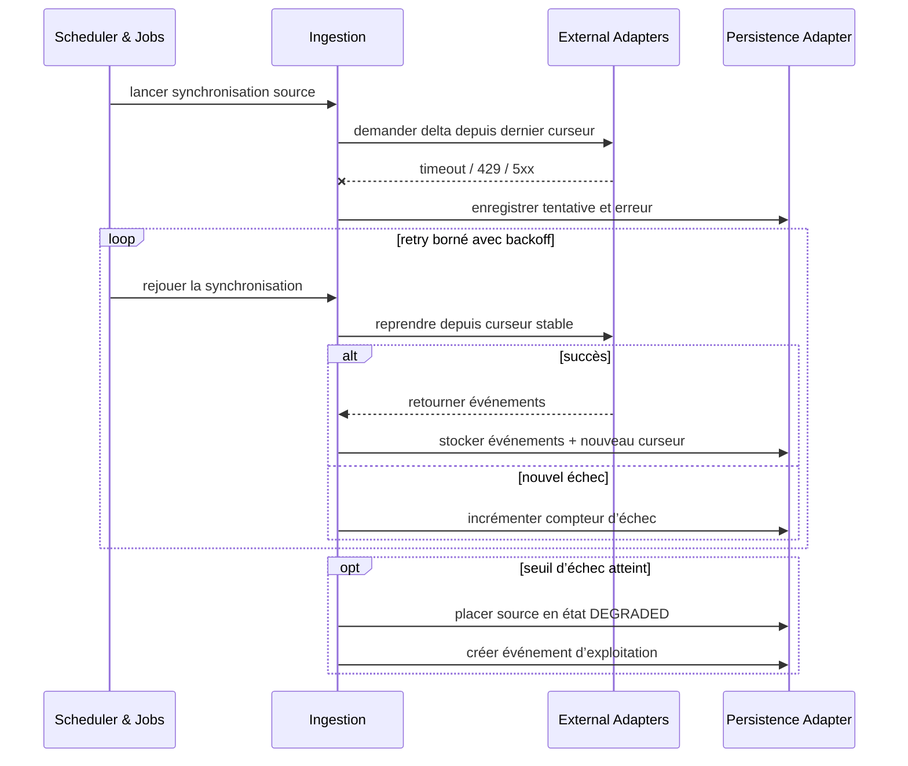
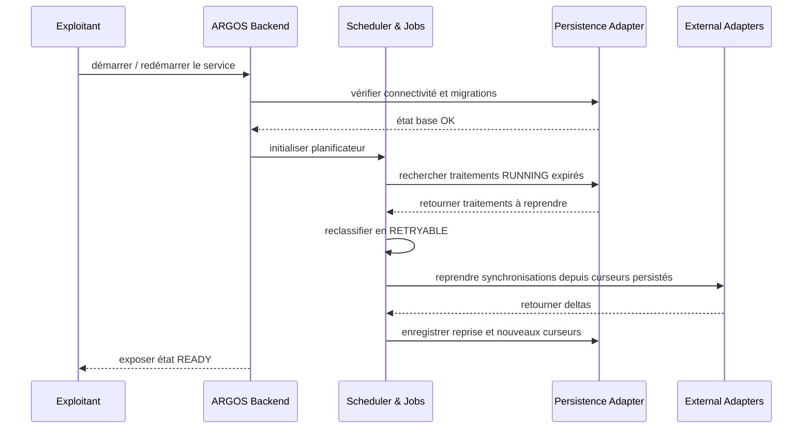

# 6. Vue d’exécution

Cette section décrit des scénarios dynamiques. Les noms des participants reprennent strictement les composants définis en section 5.

## 6.1 Scénario nominal — signal technologique vers impact projet

**Type : UML sequence diagram. Portée : traitement d’un `IntelligenceItem`.**

### Invariants

- aucune synthèse ne remplace la source ;
- toute analyse LLM doit être associée à la version du prompt/modèle ;
- la politique de confidentialité doit être évaluée avant l’appel à `AI Gateway` ;
- l’opération doit être idempotente sur la source + l’identifiant externe.

## 6.2 Scénario nominal — activité GitHub/GitLab vers Project Intelligence

**Type : UML sequence diagram. Portée : réception d’un webhook projet.**

## 6.3 Scénario d’erreur — API externe indisponible

**Type : UML sequence diagram. Portée : synchronisation planifiée.**

### Règles proposées

- ne jamais avancer le curseur avant persistance durable ;
- distinguer erreurs transitoires et permanentes ;
- respecter `Retry-After` et les rate limits ;
- ne pas boucler indéfiniment ;
- rendre visible la source dégradée dans l’observabilité.

## 6.4 Scénario d’exploitation — redémarrage/reprise

**Type : UML sequence diagram. Portée : reprise du `ARGOS Backend`.**

## 6.5 Hypothèses et validation

### Hypothèses à valider

- présence d’un scheduler interne au backend ;
- persistance des curseurs et statuts de job dans PostgreSQL ;
- retry sans broker externe au MVP.

### Preuves nécessaires

- tests d’intégration avec GitHub/GitLab/FreshRSS ;
- tests d’idempotence ;
- test de reprise après arrêt forcé ;
- métriques de retry et backlog ;
- simulation 429/5xx/timeouts.

### Risques

- doubles traitements si clé d’idempotence mal définie ;
- perte d’événement si le curseur est avancé trop tôt ;
- tempête de retry ;
- webhooks reçus dans le désordre.

### Fichiers source concernés

- futurs services d’ingestion et jobs ;
- futurs adapters ;
- futures migrations ;
- futurs tests d’intégration et de résilience.
