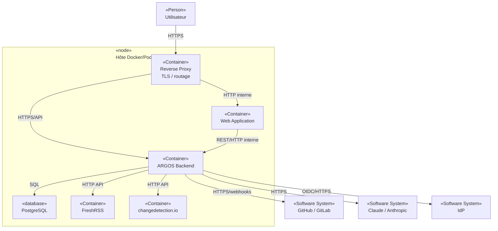
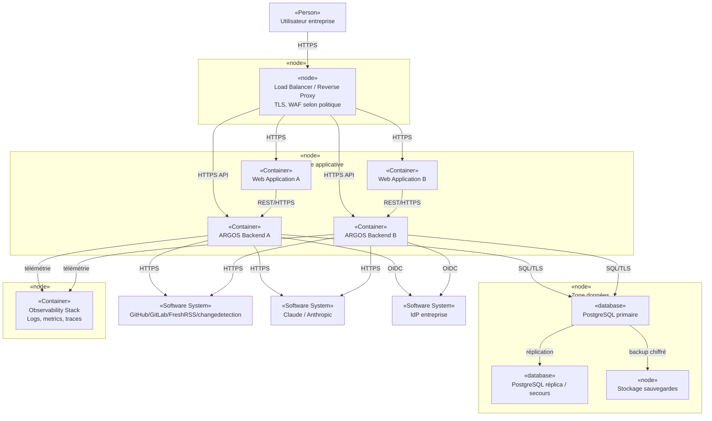

# 7. Vue de déploiement

Cette vue sépare un **POC/MVP économique** d’une cible entreprise. Les deux restent des **Hypothèses à valider** tant qu’aucun manifest de déploiement n’existe.

## 7.1 Environnements proposés

| Environnement | Objectif | Statut |
|---|---|---|
| Local | développement et tests rapides | Hypothèse à valider |
| Dev | intégration continue | Hypothèse à valider |
| Test/Préprod | validation fonctionnelle, sécurité, performance | Hypothèse à valider |
| Prod | service interne | Hypothèse à valider |

## 7.2 Déploiement POC/MVP

**Type : diagramme de déploiement UML-style. Portée : POC/MVP self-hosted.**

### Hypothèses

- un hôte suffit pour le POC/MVP ;
- PostgreSQL utilise un volume persistant ;
- les secrets ne sont pas stockés en clair dans le dépôt ;
- les services internes ne sont pas exposés publiquement sans nécessité.

### Limites

- disponibilité liée à un seul hôte ;
- scalabilité limitée ;
- maintenance et sauvegarde à opérer explicitement ;
- FreshRSS/changedetection co-localisés seulement si acceptable.

## 7.3 Déploiement entreprise cible

**Type : diagramme de déploiement UML-style. Portée : cible production à haute exploitabilité.**

## 7.4 Réseau et segmentation proposés

1. seul le reverse proxy/load balancer est exposé aux utilisateurs ;
2. PostgreSQL n’est accessible que depuis la zone applicative et les outils d’administration autorisés ;
3. les webhooks entrants passent par une route dédiée avec validation stricte ;
4. les flux sortants vers Claude et SCM passent par egress contrôlé si la politique SI l’impose ;
5. les outils d’observabilité n’exposent pas de secrets ni de payloads sensibles.

## 7.5 Protocoles architecturalement significatifs

| Flux | Protocole proposé |
|---|---|
| navigateur → ARGOS | HTTPS |
| frontend → backend | HTTPS/REST |
| backend → PostgreSQL | PostgreSQL protocol + TLS en production |
| GitHub/GitLab → backend | HTTPS webhook |
| backend → GitHub/GitLab | HTTPS API |
| backend → Claude | HTTPS API |
| backend → IdP | OIDC/OAuth2 sur HTTPS ; SAML si imposé |
| télémétrie | OTLP/HTTP ou protocole imposé par la stack |

## 7.6 RPO/RTO proposés

**Hypothèse à valider :**

- POC/MVP : RPO ≤ 24 h ; RTO ≤ 8 h ;
- production interne standard : RPO ≤ 1 h ; RTO ≤ 4 h.

Ces valeurs sont des **cibles de discussion**, pas des engagements actuels.

## 7.7 Sauvegarde et restauration

À minima :

- sauvegarde PostgreSQL automatisée ;
- rétention définie ;
- chiffrement des sauvegardes ;
- test de restauration planifié ;
- documentation du runbook ;
- conservation séparée des secrets/configurations nécessaires à la reprise.

## 7.8 Preuves nécessaires

- `Dockerfile`, Compose/Podman/Kubernetes/IaC ;
- configuration TLS/réseau ;
- stratégie de secrets ;
- procédure de backup/restore testée ;
- tests de charge et de bascule.

## 7.9 Risques

- surdimensionnement prématuré de la cible entreprise ;
- absence de test de restauration ;
- cohabitation de données sensibles et publiques sans segmentation ;
- exposition accidentelle de services internes.
