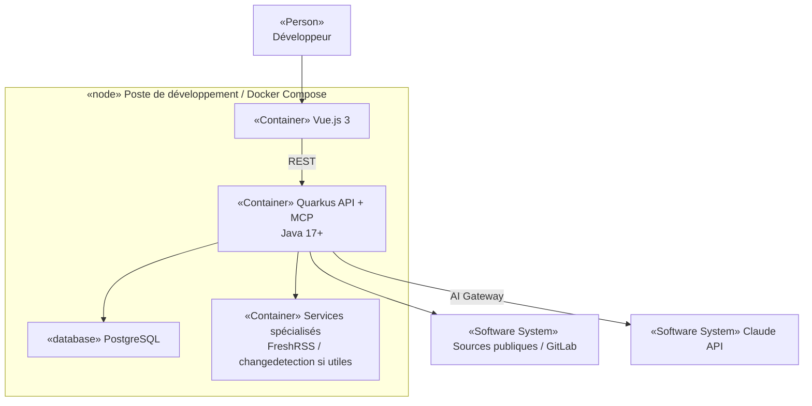
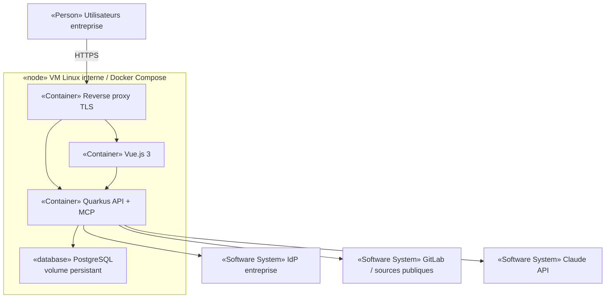

# 7. Vue de déploiement

La v2.4 distingue explicitement **POC technique local**, **POC partagé/MVP sur VM** et cible entreprise.

## 7.1 Environnements

| Environnement | Objectif | Statut |
|---|---|---|
| Local Docker Compose | développement, POC technique, démonstration sans attendre la VM | retenu pour le POC |
| VM Linux interne | POC partagé puis MVP | cible à provisionner |
| Test/Préprod | validation fonctionnelle, sécurité, performance | à confirmer |
| Prod | service interne | à confirmer |

## 7.2 POC local

```mermaid
flowchart TB
    USER["«Person»\nDéveloppeur"]
    subgraph DEV["«node» Poste de développement / Docker Compose"]
        WEB["«Container» Vue.js 3"]
        BACK["«Container» Quarkus API + MCP\nJava 17+"]
        DB["«database» PostgreSQL"]
        AUX["«Container» Services spécialisés\nFreshRSS / changedetection si utiles"]
    end
    EXT["«Software System» Sources publiques / GitLab"]
    AI["«Software System» Claude API"]

    USER --> WEB
    WEB -->|REST| BACK
    BACK --> DB
    BACK --> AUX
    BACK --> EXT
    BACK -->|AI Gateway| AI
```

Objectif : démontrer la chaîne verticale sans dépendre du délai de mise à disposition de la VM.

## 7.3 POC partagé / MVP

```mermaid
flowchart TB
    USER["«Person» Utilisateurs entreprise"]
    subgraph VM["«node» VM Linux interne / Docker Compose"]
        RP["«Container» Reverse proxy TLS"]
        WEB["«Container» Vue.js 3"]
        BACK["«Container» Quarkus API + MCP"]
        DB["«database» PostgreSQL\nvolume persistant"]
    end
    IDP["«Software System» IdP entreprise"]
    EXT["«Software System» GitLab / sources publiques"]
    AI["«Software System» Claude API"]

    USER -->|HTTPS| RP
    RP --> WEB
    RP --> BACK
    WEB --> BACK
    BACK --> DB
    BACK --> EXT
    BACK --> AI
    BACK --> IDP
```

### Principes

- même stack applicative qu’en local ;
- secrets hors dépôt ;
- volumes persistants et sauvegardes ;
- proxy sortant/listes blanches selon politique SI ;
- SSO/OIDC dès que l’environnement le permet.

## 7.4 Cible entreprise

La haute disponibilité, plusieurs nœuds applicatifs, PITR, coffre-fort de secrets et observabilité centralisée ne sont introduits qu’après validation du besoin.

## 7.5 Dépendances organisationnelles

La charge technique et la durée calendaire ne sont pas équivalentes. Le POC est estimé à **20–24 j.h** de travail effectif, mais VM, proxy/SSO, RSSI/DPO, équipes pilotes et urgences quotidiennes peuvent porter la durée à **6–10 semaines**.

Les demandes d’infrastructure doivent donc être lancées dès le début, en parallèle du POC local.

## 7.6 RPO/RTO proposés

- POC/MVP : RPO ≤ 24 h ; RTO ≤ 8 h ;
- production interne standard : RPO ≤ 1 h ; RTO ≤ 4 h.

Ces valeurs restent à valider.

## 7.7 Preuves nécessaires

- `compose.yaml` local ;
- Dockerfiles Vue.js/Quarkus ;
- configuration PostgreSQL ;
- procédure de déploiement sur VM ;
- configuration TLS/réseau/SSO ;
- backup/restore testé.

## 7.8 Risques

- attendre la VM avant de développer ;
- différences non maîtrisées entre poste local et VM ;
- absence de test de restauration ;
- exposition accidentelle de services internes.
