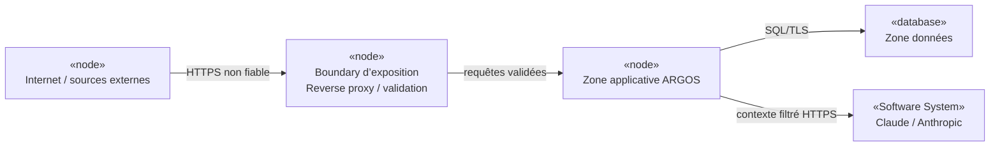
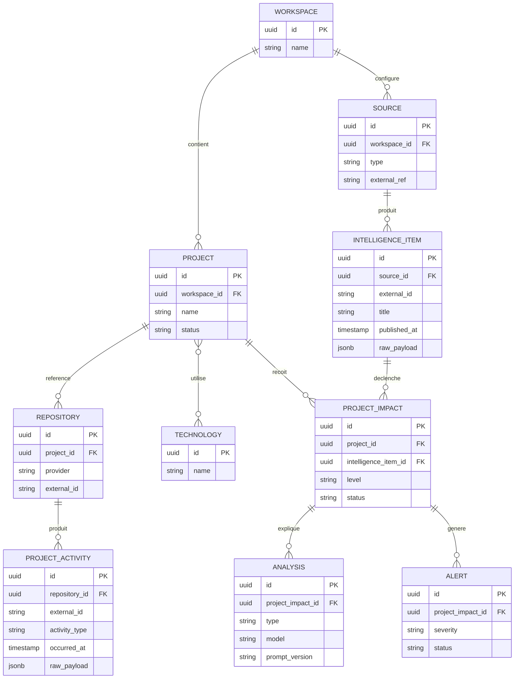

# 8. Concepts transverses

## 8.1 Identité et accès

**Hypothèse à valider :** authentification fédérée via OIDC avec l’IdP d’entreprise.

### Rôles proposés

- `USER` : consultation ;
- `PROJECT_MANAGER` : configuration projet, alertes et digests ;
- `WORKSPACE_ADMIN` : administration d’un workspace ;
- `PLATFORM_ADMIN` : administration globale ;
- `OPS` : exploitation technique.

L’autorisation doit être évaluée au niveau workspace/projet et pas uniquement par rôle global.

## 8.2 Sécurité

Principes proposés :

1. deny-by-default ;
2. validation systématique des entrées externes ;
3. signatures/secrets de webhooks vérifiés ;
4. secrets hors dépôt ;
5. chiffrement en transit ;
6. données sensibles masquées dans logs ;
7. contrôle SSRF pour les fonctions de collecte Web ;
8. quotas et rate limiting ;
9. séparation des données par workspace ;
10. contenu Internet traité comme **donnée non fiable**, jamais comme instruction LLM.

### Trust boundaries

## 8.3 Données et classification

Classification proposée :

| Classe | Exemple | LLM externe |
|---|---|---|
| PUBLIC | article public, CVE publique | autorisé sous politique |
| INTERNAL | métrique projet agrégée | à valider |
| CONFIDENTIAL | code privé, commentaires internes | interdit par défaut |
| RESTRICTED | secret, donnée réglementée | interdit |

Toute transmission à Claude doit enregistrer la classe de données, la politique appliquée et le minimum de contenu envoyé.

## 8.4 Interfaces et versionnement

- API REST versionnée lorsque rupture de compatibilité ;
- OpenAPI comme contrat ;
- adapters externes versionnés indépendamment des concepts métier ;
- contract tests sur GitHub/GitLab/FreshRSS/changedetection ;
- stratégie de dépréciation documentée.

## 8.5 Gestion des erreurs

Catégories proposées :

- `VALIDATION_ERROR` ;
- `AUTHENTICATION_ERROR` ;
- `AUTHORIZATION_ERROR` ;
- `EXTERNAL_RATE_LIMIT` ;
- `EXTERNAL_TEMPORARY_FAILURE` ;
- `EXTERNAL_PERMANENT_FAILURE` ;
- `AI_OUTPUT_INVALID` ;
- `DATA_CONFLICT` ;
- `INTERNAL_ERROR`.

Une erreur d’un connecteur ne doit pas masquer les autres sources.

## 8.6 Résilience

- timeouts explicites ;
- retry borné avec backoff/jitter ;
- circuit breaker si utile ;
- idempotence ;
- curseurs de synchronisation persistés ;
- table d’échec / DLQ logique au MVP ;
- replay contrôlé ;
- health/readiness distincts.

## 8.7 Configuration

Séparer :

- configuration non sensible versionnée ;
- secrets injectés depuis environnement/vault ;
- paramètres par workspace stockés en base ;
- feature flags seulement si besoin démontré.

## 8.8 Observabilité

### Signaux techniques

- logs structurés ;
- métriques ;
- traces distribuées si appels externes complexes ;
- correlation/event ID ;
- dashboards de santé.

### Métriques métier

- items collectés/ignorés/échoués ;
- latence source → visibilité ;
- sources dégradées ;
- webhooks acceptés/rejetés ;
- ProjectActivity ingérées ;
- impacts détectés ;
- alertes générées ;
- faux positifs confirmés si feedback disponible.

### Métriques IA

- appels par type ;
- tokens entrée/sortie ;
- coût estimé ;
- cache hit ;
- erreurs de structured output ;
- analyses refusées pour politique de confidentialité ;
- latence par modèle.

## 8.9 Persistance

**Hypothèse à valider : PostgreSQL principal.**

Usage proposé :

- tables relationnelles pour agrégats métier ;
- JSONB pour payloads externes bruts/variables ;
- FTS pour recherche initiale ;
- pgvector uniquement si embeddings démontrent un bénéfice ;
- migrations versionnées ;
- index fondés sur requêtes mesurées.

### Modèle physique conceptuel

Ce modèle est **conceptuel** et non une migration SQL acceptée.

## 8.10 Messaging

**Décision proposée : ne pas imposer de broker au MVP.**

Une file/broker sera envisagé si :

- backlog durable important ;
- besoin de plusieurs consommateurs ;
- scalabilité indépendante ;
- garantie de livraison dépassant la simplicité d’une table de jobs ;
- intégration d’événements inter-systèmes à grande échelle.

## 8.11 Performance

Cibles initiales proposées :

- API de consultation p95 < 500 ms hors appels externes ;
- aucun appel LLM synchrone bloquant pour une page standard ;
- ingestion découplée de l’affichage ;
- pagination obligatoire sur collections volumineuses ;
- batch pour synchronisations historiques.

**Hypothèse à valider par charge réelle.**

## 8.12 Concurrence

- clé d’idempotence par source + externalId/type ;
- verrouillage optimiste sur agrégats sensibles ;
- jobs revendiqués atomiquement ;
- ne pas supposer l’ordre des webhooks ;
- recalcul de métriques rendu déterministe.

## 8.13 Tests

Pyramide proposée :

- unitaires domaine ;
- tests architecture/modules ;
- tests intégration PostgreSQL ;
- contract tests adapters ;
- E2E critiques ;
- sécurité ;
- charge ;
- résilience ;
- tests IA avec jeu de référence et mesures de qualité.

## 8.14 Déploiement et rollback

- artefacts immuables ;
- migrations backward-compatible lorsque possible ;
- rollback applicatif documenté ;
- migrations destructrices en plusieurs étapes ;
- sauvegarde avant changements à risque ;
- feature flags temporaires si rollback data impossible.

## 8.15 RAG et embeddings

**Non requis par défaut.**

Cas d’usage possibles :

- recherche sémantique ;
- déduplication sémantique ;
- retrieval de contexte projet/documentation.

Avant activation : mesurer gain par rapport à FTS, coût d’embedding, isolation workspace, stratégie de suppression/rétention et risque de fuite inter-workspace.

## 8.16 Preuves, hypothèses, questions

### Observé

- aucun mécanisme transverse n’est encore implémenté.

### Hypothèses à valider

- OIDC ; PostgreSQL ; OpenTelemetry ; classification des données ; table de jobs sans broker ; objectifs de performance.

### Questions ouvertes

- IdP et vault imposés ?
- stack d’observabilité imposée ?
- politique de logs ?
- durées de conservation ?
- exigences d’audit ?

### Risques

- secrets dans configuration ;
- logs contenant contenu sensible ;
- embeddings mélangeant les workspaces ;
- appel LLM non auditable ;
- retry amplifiant une panne externe.
