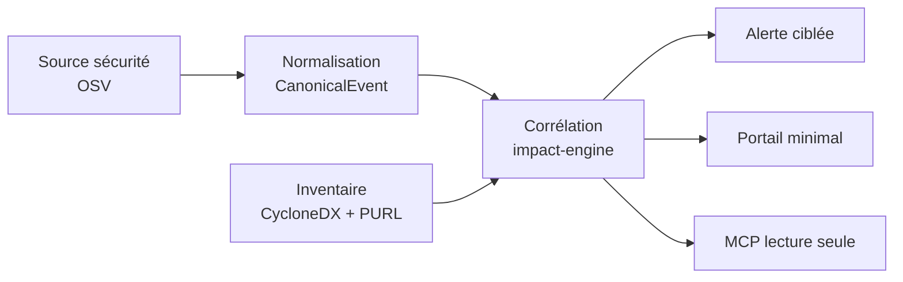
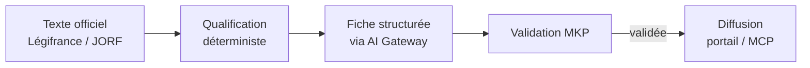

# Baseline d’architecture ARGOS v2.3

- **Date** : 27 septembre 2026
- **Statut** : proposition enrichie à valider
- **Source de cadrage** : dossier ARGOS v2.3
- **Source d’architecture versionnée** : `docs/architecture/`

## 1. Objet

Cette baseline réconcilie le dossier de proposition ARGOS avec l’état réel du dépôt. Elle ne prétend pas décrire une implémentation existante : au 27 septembre 2026, le dépôt contient la documentation et la licence, mais pas encore de code applicatif, manifest de build, Dockerfile, pipeline CI/CD, schéma SQL, API ni tests.

La règle de preuve reste :

- **Observé** : démontré par un artefact versionné ;
- **Décision proposée** : choix documenté à confirmer ;
- **Hypothèse à valider** : nécessite POC, mesure ou information d’environnement ;
- **Accepté** : décision explicitement validée dans un ADR.

## 2. Réconciliation effectuée

### 2.1 ADR

Les ADR-0001 à ADR-0009 existaient avant l’intégration du dossier v2.3 et conservent leur numérotation. Les décisions complémentaires commencent à ADR-0010 :

- ADR-0010 — sources de vulnérabilités ;
- ADR-0011 — SBOM CycloneDX ;
- ADR-0012 — Dependency-Track optionnel ;
- ADR-0013 — corrélation déterministe ;
- ADR-0014 — serveur MCP lecture seule ;
- ADR-0015 — PostgreSQL FTS / pgvector différé ;
- ADR-0016 — RBAC + RLS ;
- ADR-0017 — déploiement POC/MVP sur VM conteneurisée ;
- ADR-0018 — veille réglementaire avec validation MKP.

Tous ces nouveaux ADR sont **Proposés** jusqu’à validation par revue d’architecture et/ou preuve issue du POC.

### 2.2 Frontend

Le framework frontend reste **non déterminé**. Les mentions React, Vue ou Angular sont des alternatives, pas une décision. Le POC doit privilégier le moyen le plus simple permettant de mesurer les KPI fonctionnels.

### 2.3 n8n

n8n reste limité aux automatisations périphériques. Le cœur de collecte, normalisation, corrélation, sécurité, réglementation, MCP et alerting ne doit pas dépendre de workflows n8n.

### 2.4 Project Intelligence

L’intégration SCM minimale est nécessaire dès le POC pour récupérer dépôts, webhooks et SBOM. Les métriques complètes de Project Intelligence — activité GitLab, jalons, pipelines, releases, synthèse factuelle — restent en phase 3.

### 2.5 Documentation-as-code

`docs/architecture/` est la source de vérité de l’architecture. Le dossier Word/PDF est une vue de proposition et de décision destinée au management. Toute décision implémentée doit modifier dans la même PR les ADR, sections arc42 et diagrammes Mermaid concernés.

## 3. Chaîne verticale du POC

Le POC doit démontrer prioritairement la chaîne suivante :

Un second chemin pilote couvre la réglementation :

## 4. Matrice architecture → preuve

| Capacité | Brique principale | Preuve attendue au POC |
|---|---|---|
| Collecte sécurité | `source-ingestion` + `vuln-intel` | avis OSV collecté, normalisé, dédupliqué et historisé avec provenance |
| Inventaire projet | `inventory` + `scm-connector` | SBOM CycloneDX de deux projets, PURL et versions transitives consultables |
| Analyse d’impact | `impact-engine` | signal relié automatiquement aux seuls projets concernés, avec niveau de confiance |
| Alerte ciblée | `alerting` + `workspace` | notification pilote et statut d’action historisé |
| Radar versions/EOL | `release-radar` + `catalog` | échéances Java/Oracle/Spring calculées et filtrables |
| Standards internes | `catalog` | au moins une technologie ADOPT et une HOLD avec version cible et justification |
| MCP | `mcp-server` | `check_dependency` et `get_security_alerts` utilisables en lecture seule avec auth et audit |
| Veille réglementaire | `reg-intel` | texte officiel → qualification → fiche IA → validation MKP |
| IA maîtrisée | `ai-gateway` | prompt versionné, JSON validé, tokens/coûts tracés, dégradation sans IA |
| Exploitation | `audit` + observabilité | logs corrélés, métriques, sauvegarde/restauration testées |

## 5. Plan POC — 5 semaines / environ 12 j.h

| Semaine | Charge indicative | Livrables |
|---|---:|---|
| S1 — Fondation | ≈ 2 j.h | Spring Boot minimal, modules, PostgreSQL, migrations, CI, tests d’architecture, ADR prioritaires |
| S2 — Sécurité | ≈ 2,5 j.h | connecteur OSV, modèle canonique, déduplication/idempotence, provenance |
| S3 — Inventaire / impact | ≈ 2,5 j.h | import CycloneDX, PURL, corrélation exact/probable/à vérifier |
| S4 — Restitution / MCP / réglementation | ≈ 3 j.h | portail minimal, alerte ciblée, deux outils MCP, Légifrance pilote, fiche MKP |
| S5 — Mesure / durcissement / démo | ≈ 2 j.h | KPI, E2E, sécurité, coûts IA, restauration, démonstration et dossier go/no-go |

### Hors périmètre POC

- haute disponibilité ;
- Kubernetes/OpenShift ;
- administration avancée ;
- Project Intelligence complet ;
- pgvector/RAG ;
- broker distribué ;
- automatisations n8n non indispensables.

## 6. Critères go / no-go

1. **Sécurité** : un avis critique de test traverse collecte → corrélation → alerte sans intervention manuelle et respecte l’objectif de délai.
2. **Couverture** : les deux projets pilotes disposent d’une SBOM fraîche et exploitable, dépendances transitives incluses.
3. **Précision** : un jeu de référence permet de mesurer vrais/faux positifs et faux négatifs de la corrélation.
4. **MCP** : au moins deux outils sont utilisables depuis un IDE, en lecture seule, avec contrôle d’accès et audit.
5. **Réglementaire** : un texte du domaine pilote aboutit à une fiche validée par un MKP ; aucune fiche non validée n’est diffusée aux développeurs.
6. **IA** : aucune alerte n’est bloquée si le fournisseur LLM est indisponible ou si le plafond budgétaire est atteint.
7. **Confidentialité** : aucune donnée `CONFIDENTIAL` ou `RESTRICTED` n’est envoyée au fournisseur IA.
8. **Exploitabilité** : retry, redémarrage, rattrapage et sauvegarde/restauration sont démontrés.
9. **Coût** : consommation IA et temps d’exploitation sont mesurés et projetables.
10. **Documentation** : ADR, arc42 et Mermaid reflètent les décisions réellement prises pendant le POC.

## 7. Backlog avant le premier commit applicatif

- valider/rejeter les ADR proposés les plus structurants ;
- aligner la vue des blocs avec les modules détaillés du dossier : `workspace`, `catalog`, `inventory`, `signal`, `vuln-intel`, `release-radar`, `reg-intel`, `impact-engine`, `alerting`, `mcp-server/api`, `source-ingestion`, `scm-connector`, `ai-gateway`, `audit` ;
- versionner les sources Mermaid des figures de référence ;
- compléter le registre des risques avec MCP, SBOM partielle, réglementation et prompt injection indirecte ;
- compléter les scénarios qualité avec les cibles mesurables du dossier ;
- créer la matrice de traçabilité F01–F16 → module → ADR → test/KPI ;
- ne passer un ADR de `Proposé` à `Accepté` qu’après décision explicite et preuve correspondante.

## 8. Principe de cohérence

Le dossier de proposition peut être plus lisible et plus synthétique que la documentation technique, mais il ne doit jamais annoncer comme acquis un choix que le dépôt classe encore comme proposé. Inversement, toute décision acceptée dans le dépôt doit être reflétée au prochain jalon du dossier de proposition.
